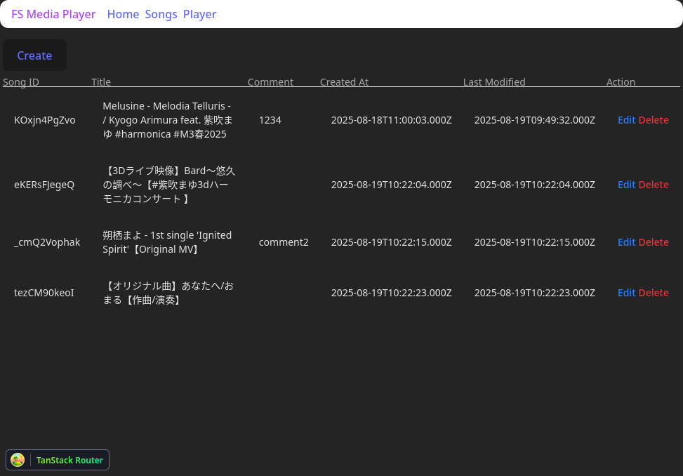

# FS Media Player

Web based media player for playing online videos / audios

Currently, this is meant for local use only, and only support Youtube videos.




## Features

* API: CRUD for songs (currently only supports Youtube Videos)
* UI: Manage songs, play songs, embed Youtube player
* When a song end, automatically go to the next song in list.

## Architecture

* Web UI: run at http://localhost:3001
* NodeJS server: http://localhost:3000
* Storage: SQLite for storing song list

## Run & Development

Currently there is only local build support and only tested under Linux.

1. Install pnpm: `npm install -g pnpm@latest-10`
2. Start server:
   ```
   cd server
   pnpm i --frozen-lockfile
   npm run start:dev
3. Start UI:
   ```
   cd ui
   pnpm i --frozen-lockfile
   npm run dev
   ```
4. Open http://localhost:3001


DB is stored at `server/db.sqlite`

## Tech Stacks

### General

* Typescript
* eslint
* prettier
* pnpm

### UI

* Vite
* React 19
* Material Tailwind (with React binding)
* react-hook-form
* @tanstack/react-query
* @tanstack/react-router

### Server

* NestJS
* TypeORM
* class-transformer & class-validator

### Storage

* SQLite (nodejs binding)

## TODOs / Feature wish list

* Better error handling
* Package dev env into docker, so that NodeJs and SQLite is not platform dependant.
* Need better UI design in general
* Spotify support
* Soundcloud support
* `Playlist` DB, APIs, and UI
* [?] Artist DB and APIs?
* Play songs from playlist
* shuffle songs in playlists
* include multiple playlists in player
* support tags
* search songs and playlists based on title, artist, and tags
* Unit tests with jest
* Public Release (Package these to standalone executables)
